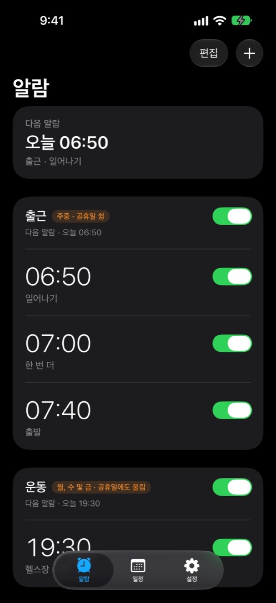
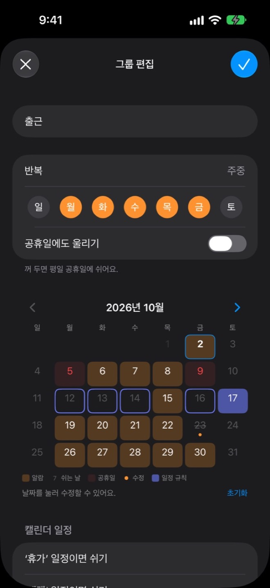
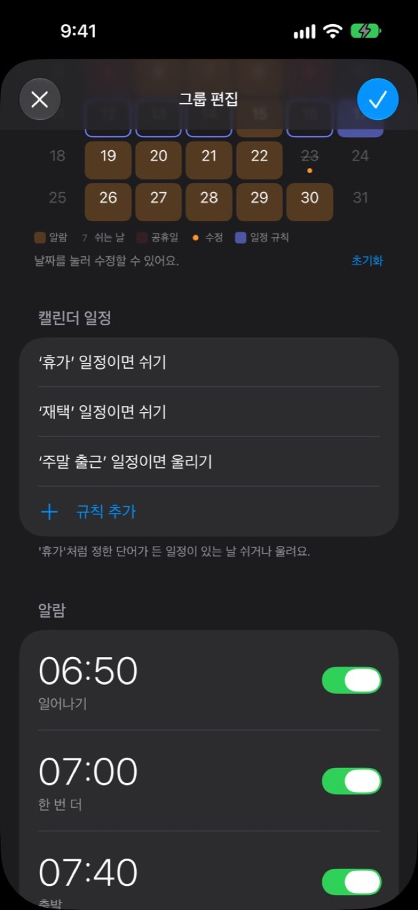
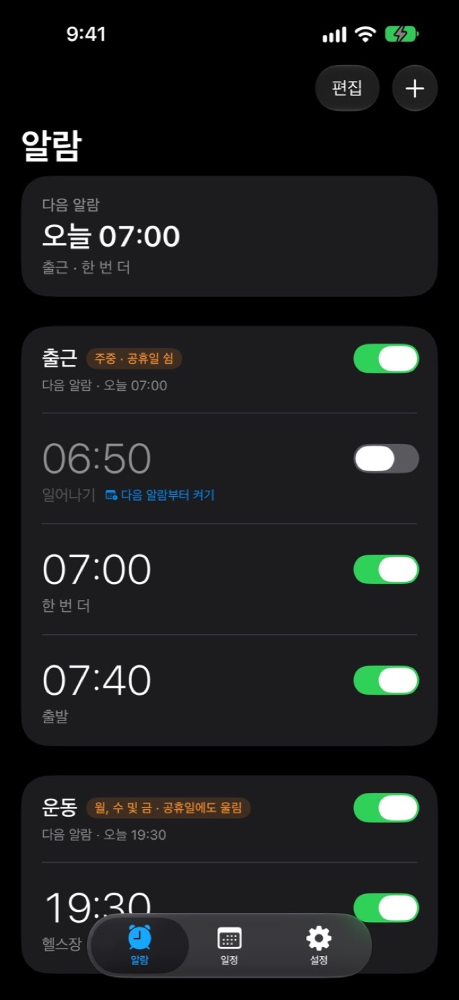

# Kairos

**휴일엔 알아서 쉬는 알람.** 내 일정에 맞춰 알람이 알아서 켜지고 꺼지는 iPhone 알람 앱입니다.

휴가 전날 알람 끄는 걸 깜빡하거나, 주말 출근 날 알람 켜 두는 걸 잊은 적 있나요? Kairos는 공휴일과 캘린더 일정을 보고 그날 울릴지 쉴지를 알아서 정해요. 아이폰 기본 시계 앱과 같은 방식으로 쓰면서, 날마다 직접 챙기던 일을 대신 해 줘요.

  
  
  
  

## 이런 걸 할 수 있어요

### 공휴일엔 알아서 쉬어요
- 평일 공휴일과 대체공휴일에는 출근 알람이 울리지 않아요.
- 공휴일에도 울려야 하는 그룹은 `공휴일에도 울리기` 스위치 하나로 바꿔요.
- 공휴일 정보는 앱 업데이트 없이 자동으로 최신으로 받아요.

### 캘린더 일정에 맞춰 쉬거나 울려요
- ‘휴가’, ‘재택’처럼 정해 둔 단어가 든 일정이 있는 날은 쉬어요.
- ‘주말 출근’ 일정이 있는 날은 주말이어도 울려요.
- 아이폰 캘린더에 동기화한 Google 캘린더 일정도 볼 수 있어요.

### 그룹으로 한 번에
- 출근 알람 여러 개를 한 그룹으로 묶고 반복 요일을 한 번에 정해요.
- 그룹을 끄면 안의 알람이 모두 꺼지고, 다시 켜면 그대로 돌아와요.
- 오늘 알람만 쉬고 싶으면 끄고 `다음 알람부터 켜기`를 누르세요. 다음 알람부터 다시 울려요.

### 달력에서 날짜별로 바로 고쳐요
- 그룹 달력에서 날짜를 눌러 그날만 쉬거나 울리게 바꿔요.
- 일정 탭에서 날짜별로 어떤 알람이 울리고 왜 쉬는지 한눈에 봐요.
- 전날 밤 정해 둔 시각에 ‘내일 알람’ 안내를 받을 수 있어요.

### 알람답게 울려요
- 아이폰 알람(AlarmKit)으로 울려 무음 모드와 집중 모드에서도 울려요.
- 다시 알림 간격을 1–15분으로 고르고, 잠금 화면과 다이내믹 아일랜드에서 남은 시간을 봐요.
- 직접 만든 기상음 10가지 중에서 고를 수 있어요.

### 위젯으로 한눈에 (1.1부터)
- 잠금 화면과 홈 화면에서 다음 알람을 바로 봐요.
- 내일 쉬는 날이면 왜 쉬는지와 다음에 울릴 때를 알려 줘요.

## 필요한 것

- iOS 26.0 이상의 iPhone
- 한국 App Store, 무료
- 알람 권한(필수), 알림 권한(전날 안내를 쓸 때), 캘린더 권한(캘린더 규칙을 쓸 때)

## 알아 두면 좋은 점

- **캘린더에 일정을 새로 넣었다면 앱을 한 번 열어 주세요.** 앱이 꺼져 있으면 다음 백그라운드 갱신 때까지 이미 맞춰 둔 알람이 그대로 울릴 수 있어요.
- 알람은 앞으로 울릴 것을 미리 기기에 맞춰 둬요. 아주 오랫동안 앱을 열지 않으면 맞춰 둔 알람이 바닥날 수 있으니 가끔 앱을 열어 주세요. 다시 확인이 필요하면 앱 위쪽에 안내가 보여요.
- 캘린더 접근을 꺼 두면 캘린더 규칙 없이 요일대로 울려요.
- iOS 벨소리 목록은 고를 수 없어요. iPhone 알람 기능(AlarmKit)이 앱에 든 소리만 받기 때문이에요.

## 개인정보

- 가입이나 로그인이 없고, 모든 설정은 기기에만 저장돼요.
- 어떤 데이터도 수집하거나 추적하지 않아요.
- 캘린더 일정 제목은 기기 안에서 정해 둔 단어를 찾는 데만 쓰고 저장하거나 보내지 않아요.
- 공휴일 자료를 받을 때도 기기 정보를 보내지 않아요.

자세한 내용은 [개인정보처리방침](https://kairos.vicals.com/privacy.html)을 참고하세요.

## 문의

사용 중 궁금한 점이나 문제는 [지원 페이지](https://kairos.vicals.com/support.html)나 [Issues](https://github.com/woosublee/kairos/issues)로 알려 주세요.

## 이 저장소

- 웹페이지 [kairos.vicals.com](https://kairos.vicals.com/)(소개 · 개인정보처리방침 · 지원)의 원본이에요.
- `holiday-data/`: 앱이 내려받는 대한민국 공휴일 자료(서명 포함)예요. 임시공휴일이 생기면 여기를 고쳐 앱 업데이트 없이 반영해요.
- 앱 소스 코드는 이 저장소에 없어요.
